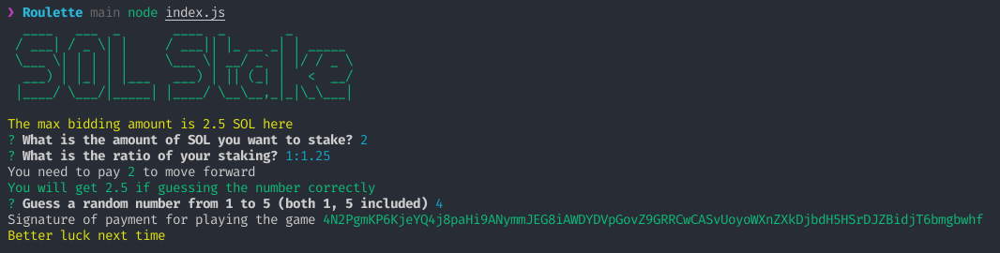
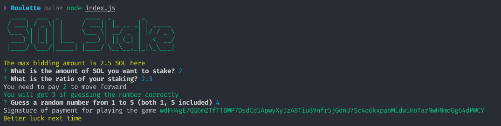
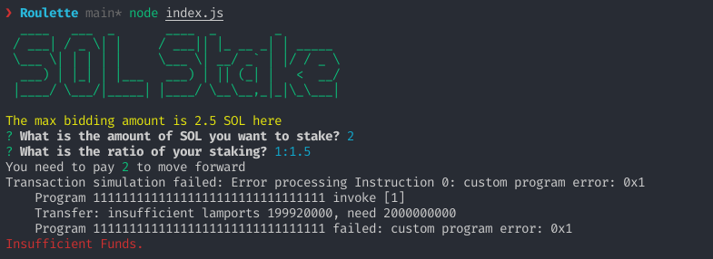
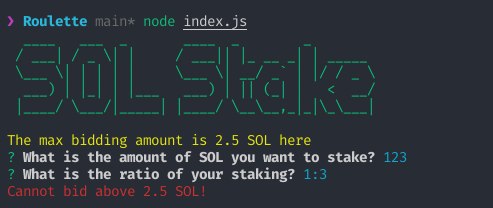
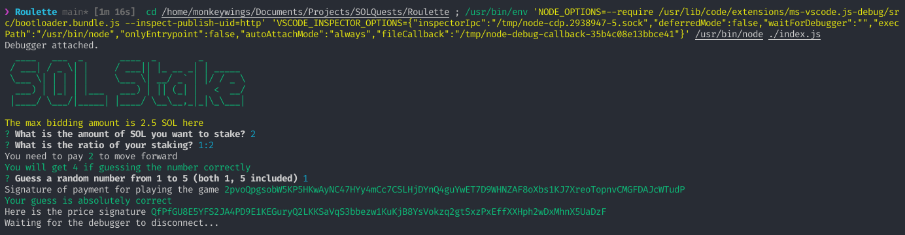

# Quest 2 - Roulette Game

This is the second quest from the Solana Questbook. It is a simple game of gambling SOL for guessing a number, although the user gives the ratio so I'm not sure how practical it is. 

On initial run, two wallets will be created in `./solana-wallet`. These can be removed to reset them.

To airdrop SOL into these wallets, run

```
solana airdrop 2 $(solana-keygen pubkey solana-wallet/keypair.json)
```

**NOTE:** Replace keypair.json with keypair2.json for the other one.

Here are a few test cases (I had to run a debug for the winning case cause my luck is that bad):





